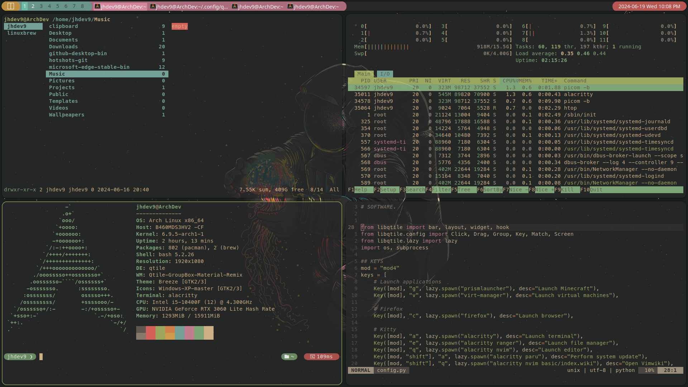

# Qtile Gruvbox Material Remix Theme

A customized Qtile theme based on the popular Gruvbox Material color scheme https://github.com/hiimsergey/qtile-gruvbox-material.

### Required Dependencies
- Qtile
- Alacritty
- Picom
- Python
- Homebrew
- Neovim
- Oh-my-posh

### Important
To ensure the theme looks as intended, you should use a Nerd Font. This theme specifically uses FiraCode and Meslo.

## Pictures

## License

This project is licensed under the terms of the [GNU General Public License v3.0](https://www.gnu.org/licenses/gpl-3.0.html).
